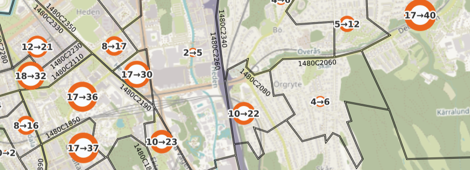
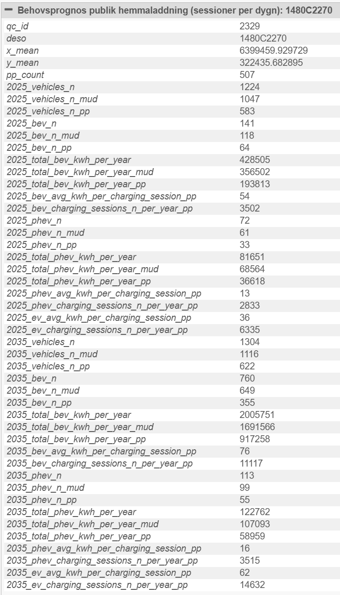
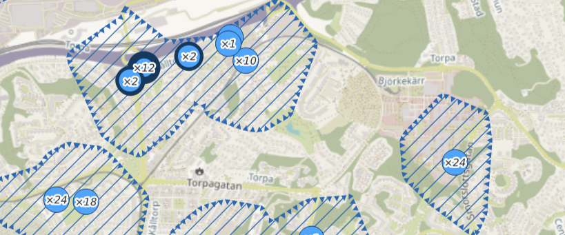
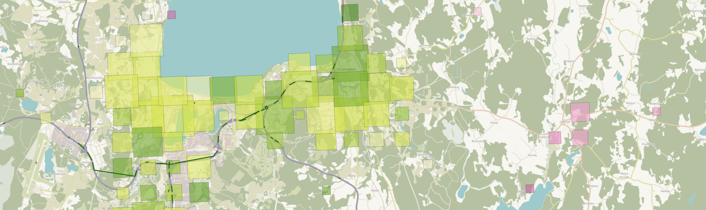
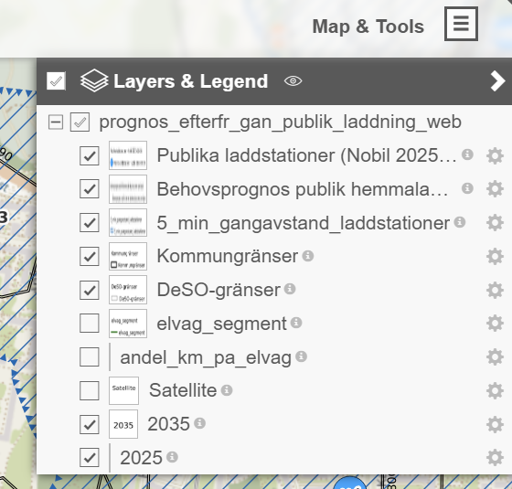

# El för ännu fler
This repository contains source code and data from the research project [El för ännu fler](https://www.ri.se/sv/expertisomraden/projekt/el-for-annu-fler).

## Interactive web map of public home charging demand

The project has developed an [interactive web map](https://qgiscloud.com/elforannufler/prognos_efterfr_gan_publik_laddning_web/) to create a better understanding of today's demand for public home charging, as well as how this demand is expected to develop in the future.

The map presents for each DeSO the estimated number of charging sessions per annual average day from rechargeable passenger cars with public parking, for the years 2025 (white circles) and 2035 (orange circles). Daily charging session estimates are shown as "2025->2035". The forecasts assume that all affected cars resident in the area are charged there and do not take into account additional incoming traffic.

If a circle is selected, additional information is presented about the estimated number vehicles (total, BEV and PHEV), in multiunit dwellings ("mud" (oops)) and with public parking ("pp").

The map also shows existing public charging stations (blue circles) with the number of charging outlets (×N) and average charging power per outlet (thicker border indicates higher charging power, in the intervals <22 kW, 22-100 kW and >100 kW). Dashed areas indicate a maximum five-minute walking distance to a public charger. Charger data represents a snapshot of the NOBIL database from August 19, 2025.

Finally, the map presents how much traffic is generated by vehicles belonging to households in multi-family buildings, per square kilometer and to what extent this traffic could be charged via future electric road infrastructure. The size of the squares corresponds to the amount of traffic generated (vehicle km/day) and the color indicates how large a proportion of this total mileage is on roads where it is reasonable to assume that electric road infrastructure will be built, if such is built in Sweden. An electric road is assumed to provide at least double the charging power in relation to the vehicles' energy consumption, which would mean that 50% of the mileage on an electric road could cover the entire daily energy requirement. Green shades indicate that the vehicles drive at least 50% on the potential electric road, yellow shades about 35%, white shades about 25%, and pink shades about 15% or less. Green lines indicate the route for a potential electric road that has been used in the calculation.

Individual map layers can be turned on and off via the menu in the top right corner.

See [methods.md](docs/methods.md) for documentation of how the data presented in the map were calculated.
