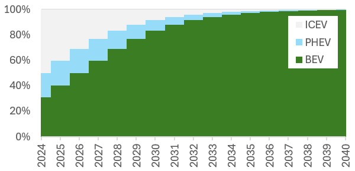
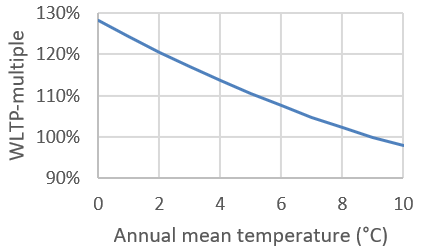
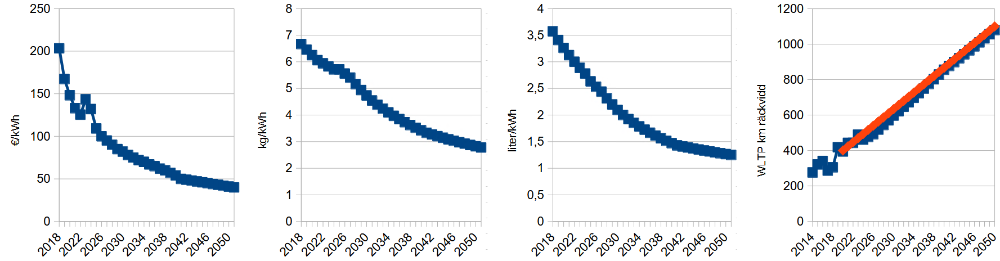

# Methods

The El för ännu fler research project was focused on studies of "public home charging". 
For this map, public home charging was defined as charging in close proximity to the homes 
of car owners without access to private parking at home. An interactive web map was developed 
to present the estimated demand in 2025 for public home charging, forecasted demand in 2035, 
and existing public charging infrastructure. This repository also provides forecasts for all 
years 2025–2035 and every five years until 2050. The calculations that have been performed and
the data on which each calculation is based are documented here.

## Potential or demand?

Both our own data analysis and several studies from other researchers show that there is a 
relatively strong correlation between the local share of electric cars and where public 
charging is offered. However, the project has not been able to demonstrate, either through 
data analysis or literature studies, that access to public charging near homes with public 
parking leads to an increased uptake of rechargeable cars in the local area. The relationship 
seems to be the reverse: that charging operators establish charging infrastructure in areas 
where the demand for chargeable cars is greatest.

Since we do not see that increased supply of public home charging leads to an increased number 
of electric cars, we cannot say that a lack of public home charging inhibits electric car 
adoption, or that public home charging is preferable to other practical and affordable solutions 
that can supply the same amount of energy to the same vehicle. ***Our forecasts for demand for 
public home charging are therefore forecasts assuming that public home charging is the solution 
that society chooses to meet the everyday charging needs of these vehicles.*** The forecasts do not
constitute a recommendation that this is the solution that best meets the needs of users. Other 
charging solutions that could theoretically meet the same needs are fast charging or battery 
swapping stations at supermarkets and energy stations, daytime charging at workplaces and urban
electric roads. An alternative calculation is presented of which vehicle charging needs could be 
covered by electric roads, if such infrastructure is built where it is assumed to be most 
cost-effective for heavy vehicles.

## Estimating the probability that vehicles use public parking

To calculate the demand for public home charging, the proportion of vehicles that use public 
parking is needed. We have not been able to find any register that directly or indirectly 
indicates how many parking spaces are available in connection with a property today or that
were established when the property was built. Lack of register data has made it difficult to 
identify for which vehicles public home charging may be relevant.

The proportion of households with access to parking on block land is referred to as the 
property's parking rate. In discussions with the project's municipal participants, it became 
clear that different parking rates applied in different municipalities during different time
periods. Since the project's purchased data on parking rates from the Transport Analysis
(Trafikanalys) was shown to primarily describe conditions in Sundbyberg, an alternative
method with national coverage was required to estimate the local parking rates. The table 
below was developed in dialogue with ChatGPT, where the model itself had to [search for and 
interpret](https://chatgpt.com/share/68d2a5ee-c7f0-8001-91d8-bfd991e25480) dozens of different 
sources. The question was phrased in different ways and the 
model was asked to review the results produced by other runs, to try to explain differences 
and correct its own mistakes. In the absence of other sources, this table is the best 
information we have on how Swedish parking rates have varied over time and between different 
parts of the country. The table has been deemed reasonable by the municipal participants in 
the project.

| Years of construction | Pop./km2 <1,000 | 1,000–1,999 | 2,000–4,999 | 5,000–9,999 | ≥10,000 |
| --- | --- | --- | --- | --- | --- |
| ≤1945 | 30% | 25% | 20% | 10% | 10% |
| 1945–1960 | 45% | 40% | 35% | 25% | 15% |
| 1961–1975 | 95% | 90% | 85% | 75% | 65% |
| 1976–1990 | 85% | 80% | 75% | 65% | 55% |
| 1991–2005 | 75% | 70% | 65% | 55% | 45% |
| 2006–2020 | 60% | 55% | 50% | 40% | 30% |

Parking figures have been combined with register data on households to estimate the private 
parking supply per property. Of this total supply, 10% of the spaces have been assumed to be 
reserved for visitors and the remainder has been assumed to have an occupancy rate of 85%. The
number of cars per property that use public parking (and request public home charging if they 
are electric) has then been assumed to be the number that exceeds the property's own number of 
remaining spaces. Small houses have always been assumed to have two spaces per household. This 
is slightly higher than the actual average, but in the calculations the figure actually refers
to the number of passenger cars that can be kept charged with the property's own charger.

## Forecast for number of electric cars per DeSO and year

The project's forecasts for demand for public home charging are also based on forecasts for 
the number of rechargeable cars (full electric and plug-in hybrids) per DeSO. Future numbers 
have been estimated based on the distribution of model years in the area today, the 
age-standardized local share of rechargeable cars, and an assumed national development for 
the share of rechargeable cars in new sales, according to the figure below. For years before 
2024, historical values were used.

A ten-year-old car today is assumed with this method in 2040, before local adjustment, to be 
fully electric with an 83% probability (the share in new sales ten years earlier).

The local (single-DeSO) age-standardized share of chargeable cars has been calculated as

$r_{norm} = \frac{n_{obs}}{n_{exp}} = \frac{L_{2023}}{\sum_{year} R_{year} * C_{year}}$, 

where $L$ = number of EVs in that DeSO, $R$ = national EV share in that model year, and $C$ = number
of cars in that DeSO. $r_{norm}$ has been assumed to converge linearly towards $r_{norm}=1$ by the year 2050.

The age distribution in the population has been assumed to be constant over time and the 
turnover rate in the population has been assumed to be independent of the type of powertrain.

The number of cars per DeSO has been assumed to increase in line with the municipality's 
population forecast.

## Assumptions on energy consumption

The energy consumption of electric cars has been assumed to decrease over time as a result
of technological development, and to be climate-dependent. The WLTP consumption (Wh/km) has
been assumed to decrease by half a percent per model year, from the local average today if 
at least ten electric cars are in the area, or the national average (175.7 Wh/km in 2023). 
This gives an average WLTP consumption of 153.5 Wh/km in 2050.

The actual energy consumption of electric cars has been assumed to depend on the county's 
annual average temperature, according to the figure below. Local annual average temperatures 
vary between zero and nine degrees in Sweden. The multiple is used to convert annual mileage 
to annual energy consumption. The multiple does not affect the vehicles' assumed battery 
capacity, only their battery range and thus how often charging is required.

## Forecast for future battery capacity per vehicle

We assess that it is likely that future rechargeable cars will have longer ranges than today,
due to a combination of demand (historical trend) and battery technology improving over time. 
The figure below shows approximate historical and assumed future values ​​for battery system 
cost (€/kWh) and energy density (kg/kWh and liter/kWh). Range (WLTP) has been calculated for
Swedish electric passenger cars of model year 2014–2023 and average values ​​for battery price,
weight and volume have been estimated for the years 2019–2023. A forecast was then calculated
assuming that none of these are allowed to increase (with the consequence that weight and 
volume are relatively constant and the cost decreases). When the forecast became close to 
linear, the relationship was simplified to a linear increase in the WLTP range from 400 km 
in 2020 to 1100 km in 2050. The range has then been converted to a battery capacity per DeSO 
given the average consumption of local electric cars today (WLTP according to the vehicle 
register, or national average in the absence of local electric cars) and future developments.
If the calculation is repeated in the future when more budget cars have reached the market 
and electric car ownership has increased in low-income areas, we also recommend that local 
deviations in battery capacity are taken into account in the forecasts.

The battery capacity for plug-in hybrids has been assumed to be 30% of the capacity of
all-electric passenger cars of the same model year.

## Charging behavior assumptions

We have assumed that cars that are primarily charged via public charging infrastructure 
close to home are charged when needed, rather than every night. A typical charging session
for a fully electric vehicle has therefore been assumed to go from an average of 100 km
range and 30% State-of-Charge, to 90% State-of-Charge. Plug-in hybrids have been assumed
to charge from 10 km range to 90% State-of-Charge during a typical charging session.

## Forecast of demand for public home charging per DeSO and year

Forecasts for the number of passenger cars and light trucks that are fully electric or 
plug-in hybrids and for which public home charging may be relevant are combined with 
forecasts for energy consumption, battery capacity and assumed charging behavior. Together,
these provide forecasts per DeSO and year for the number of charging sessions and total 
charged energy per year or per annual average day.

## Proportion of public home charging that can be replaced by electric roads

Since no charging method could be identified as clearly advantageous over other solutions 
for residents without access to private parking, we consider it justified to also estimate
the extent to which other charging infrastructure can meet the same charging needs. Public
fast charging is always assumed to be an alternative, which is why no forecasts have been
produced for this type of infrastructure. Conditions for charging at workplaces have been 
assumed to vary greatly, which is why we have not set out to calculate how good these
opportunities may be.

Previous studies have calculated approximately which road networks could be relevant in 
Sweden for the establishment of electric roads for heavy trucks. Depending on the choice 
of technology, such an electric road network could also be used by passenger cars and 
light trucks.

To understand the extent to which public home charging could be replaced by electric road 
charging, simulated travel plans from SySMo were used. Itineraries belonging to agents were 
grouped by the agent's home address in a grid where each square is one square kilometer. 
For each square, the proportion of total mileage that is on a potential electric road 
network was calculated. The designated electric road network has been approximated as 
roads that in SySMo have Capacity > 2000.

